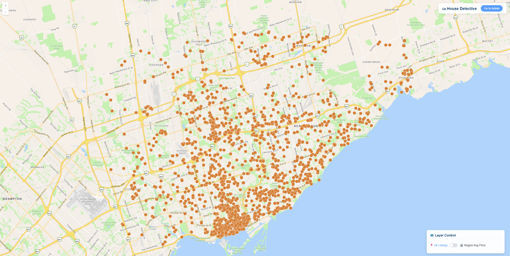
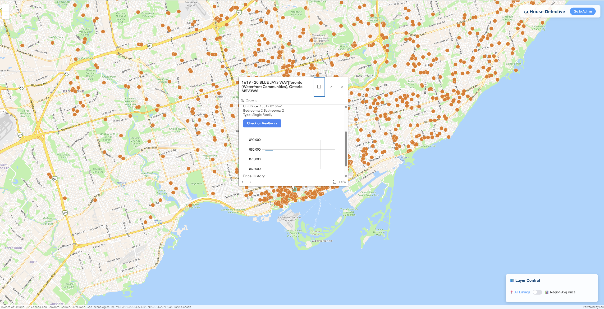
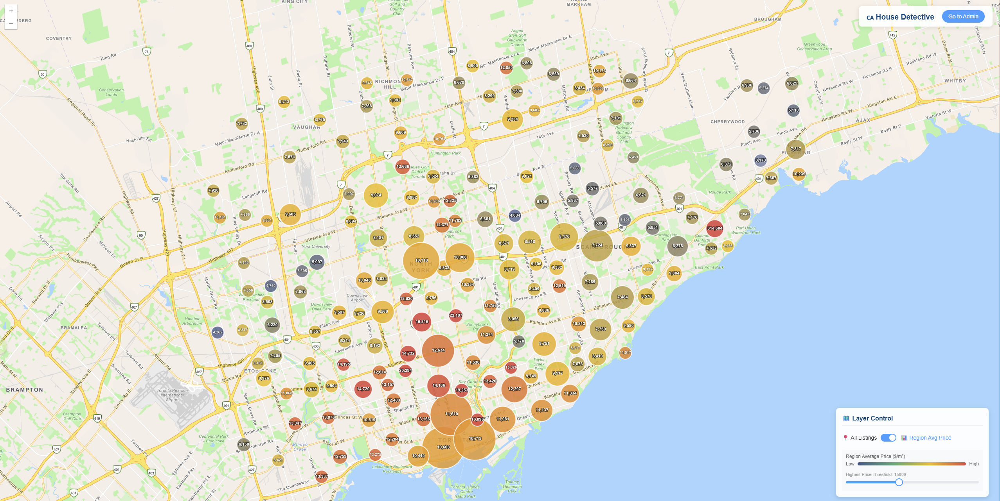
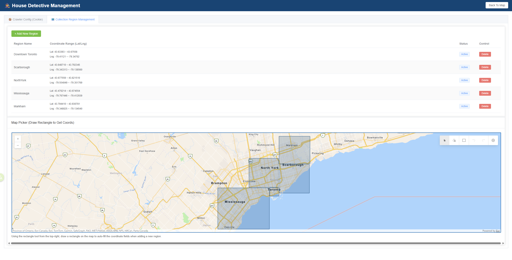

# 🕵️‍♀️ House Detective (WIP)

**House Detective** is a web-based geographic information tool designed to crawl, analyze, and visualize housing market data from Realtor.ca. It allows users to monitor property listings, track price history, and analyze regional price trends through an interactive map interface.

---
## Interface Display

---

## ✨ Key Features

### 📍 Interactive Map View
* **Real-time Visualization**: View housing listings as interactive points on a high-performance map.
* **Rich Popups**: Click on any listing to view property details, high-resolution images, and direct links to the source.
* **Price History Charts**: Visualize listing price trends over time using integrated line charts within the map interface.

### 📊 Market Analysis
* **Region Aggregation**: Toggle "Analysis Mode" to see clustered regional data instead of individual points.
* **Dynamic Heatmaps**: Automatically calculate and display average unit prices ($/m²) for specific areas.
* **Intensity Control**: Adjust price thresholds via a slider to highlight different market segments dynamically.

### 🛠️ Admin Management
* **Crawler Configuration**: Manage session cookies to maintain active connections with data providers.
* **Visual Region Management**: 
    * View existing collection boundaries on a management map.
    * **Map Picker**: Draw rectangles directly on the map to define new data collection zones.
    * **Live Sync**: Coordinates (Lat/Lng) are automatically extracted from the map and updated in real-time as you draw or adjust the box.

---

## 🚀 Tech Stack

* **Frontend**: [Vue.js 3](https://vuejs.org/) 
* **UI Framework**: [Element Plus](https://element-plus.org/)
* **Mapping Engine**: [ArcGIS Maps SDK for JavaScript](https://developers.arcgis.com/javascript/latest/)
* **Data Base**: [MongDB]([https://axios-http.com/](https://www.mongodb.com/))

---

## 🗺️ Roadmap
- [x] Basic Map integration and Feature Layer rendering.
- [x] Regional clustering and price analysis mode.
- [x] Admin panel for Cookie and Region management.
- [x] Visual coordinate picking tool (Rectangle Sketch).
- [x] Real-time coordinate sync during sketch updates.
- [x] Automated crawler scheduling (Backend).
- [ ] Advanced filtering (Price, Bed/Bath, Property Type).
- [ ] User authentication for the Admin panel.
- [ ] Auto notify user the change of average price.

---
